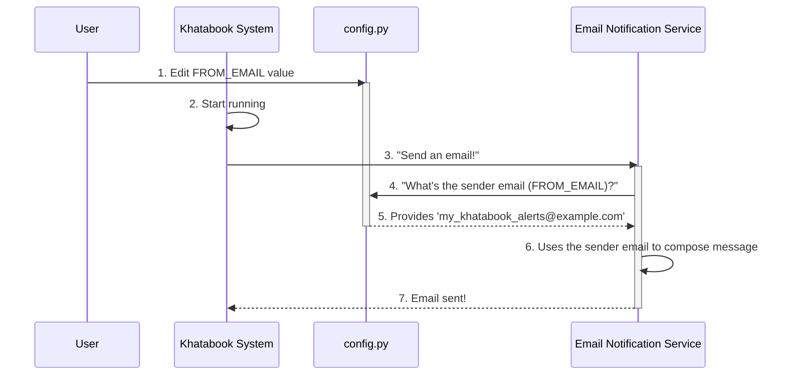

# Chapter 1: System Configuration

Imagine your smartphone. It has a "Settings" app, right? This is where you change your Wi-Fi password, adjust screen brightness, or set a new ringtone. You don't need to be a programmer to change these things; you just go to the settings and make your choices.

The `Khatabook Auto Reminder System` also has its own "settings" or "control panel." We call this **System Configuration**.

## What Problem Does System Configuration Solve?

Think about how our system sends email reminders. It needs to know:
*   Which email server to use (e.g., Gmail's server)?
*   What's the email address and password for sending emails?
*   What email address should show as the "sender"?

If these details were "hardcoded" (meaning, directly written) into the program's main instructions, changing them would mean digging into the code and changing specific lines. This is like having to open up your phone and rewire it just to change your ringtone! That's not easy for everyone and can lead to mistakes.

**System Configuration** solves this. It's a special place (a file, in our case) where all these important settings and preferences are stored. This makes it super easy to customize the system's behavior *without changing its core logic*. It's like having a dedicated "settings menu" for our Khatabook system.

Let's look at a concrete example: How would you change the email address from which the system sends reminders?

## Getting to Know `config.py`

In our Khatabook project, this "control panel" is handled by a file named `config.py`. The `.py` extension tells us it's a Python file, but for configuration, it mainly holds simple values.

You can find `config.py` right in the main folder of the project.

```python
# --- File: config.py ---
SMTP_SERVER = 'smtp.yourmail.com'
SMTP_PORT = 587
SMTP_USERNAME = 'your_email@example.com'
SMTP_PASSWORD = 'your_email_password'

CREDIT_DUE_DAYS = 30
BAD_DEBT_THRESHOLD_DAYS = 60

REMINDER_DAYS_BEFORE = 7
REMINDER_DAYS_AFTER = 7

BACKUP_PATH = 'backup/Khatabook_backup.db'
DB_NAME = 'Khatabook.db'

FROM_EMAIL = 'noreply@Khatabook.com'
```
This `config.py` file is where all the system's "knobs and dials" are located. Each line sets a specific option. For instance:

*   `SMTP_SERVER`, `SMTP_PORT`, `SMTP_USERNAME`, `SMTP_PASSWORD`: These are details for connecting to an email server to send emails.
*   `CREDIT_DUE_DAYS`: How many days before a credit payment is due.
*   `FROM_EMAIL`: The email address that appears as the sender of notifications.

### How to Change the "Sender" Email

To solve our example problem (changing the email address the system sends reminders *from*), you would simply open the `config.py` file and edit the `FROM_EMAIL` line:

```python
# In config.py
# ... other settings ...
FROM_EMAIL = 'my_khatabook_alerts@example.com' # Change this to your desired sender email
```
After saving this change, the next time the system runs and sends an email, it will use `my_khatabook_alerts@example.com` as the sender, without you needing to touch any other part of the code!

The `README.md` file (the main instruction manual for the project) also tells you to set this up:

```markdown
# --- File: README.md ---
# ...
## Setup Instructions

1. Install Python 3.x.

2. Install dependencies (if any).

3. Configure `config.py` with your email SMTP credentials.

4. Run the program:
# ...
```
This step in the `README.md` explicitly tells you that `config.py` is the place for these initial settings.

## How the System Uses Configuration (Under the Hood)

So, how does the rest of the Khatabook system know about these settings? It's quite simple! Other parts of the program "read" from `config.py` when they need a piece of information.

Let's trace how the `FROM_EMAIL` setting is used by the `Email Notification Service`.



1.  **You (the User)** first open `config.py` and change the `FROM_EMAIL` value.
2.  Then, **the Khatabook System** (when you run it, for example, to send reminders) starts its operations.
3.  When a part of the system, like the **Email Notification Service**, needs to send an email, it asks for the necessary settings.
4.  The **Email Notification Service** specifically asks the `config.py` file for the `FROM_EMAIL` value.
5.  `config.py` gives back the updated email address (e.g., `my_khatabook_alerts@example.com`).
6.  The **Email Notification Service** then uses this information to put the correct sender address in the email.
7.  Finally, the email is sent!

### Looking at the Code

Let's see how this works in the actual code. We'll look at the `email_service.py` file, which is responsible for sending emails.

```python
# --- File: email_service.py ---
import smtplib
from email.mime.text import MIMEText
from email.mime.multipart import MIMEMultipart
from config import SMTP_SERVER, SMTP_PORT, SMTP_USERNAME, SMTP_PASSWORD, FROM_EMAIL # <--- This line is key!

def send_email(to_email, subject, body):
    try:
        message = MIMEMultipart()
        message['From'] = FROM_EMAIL # <--- FROM_EMAIL is used here!
        message['To'] = to_email
        message['Subject'] = subject

        # ... (rest of the email sending logic) ...
```
In the code above:
*   The line `from config import ... FROM_EMAIL` means "Go to the `config.py` file and bring in (or "import") the `FROM_EMAIL` setting (along with other email settings)."
*   Once `FROM_EMAIL` is imported, it's just like any other variable. The line `message['From'] = FROM_EMAIL` directly uses the value that you set in `config.py`.

This same pattern applies to other settings too. For example, in `scheduler.py` (which handles sending reminders based on dates), it imports `REMINDER_DAYS_BEFORE` and `REMINDER_DAYS_AFTER` from `config.py`:

```python
# --- File: scheduler.py ---
import datetime
# ...
from config import REMINDER_DAYS_BEFORE, REMINDER_DAYS_AFTER, CREDIT_DUE_DAYS # <--- Importing reminder settings

DATE_FORMAT = "%Y-%m-%d"

def send_due_reminders():
    today = datetime.date.today()

    # ...
    # This value comes from config.py
    if days_diff == REMINDER_DAYS_BEFORE:
        # Send a reminder 7 days before
        pass
    # ...
```
Here, `REMINDER_DAYS_BEFORE` and `REMINDER_DAYS_AFTER` are loaded from `config.py`, making it easy to adjust when reminders are sent without changing any complex logic in `scheduler.py`.

## Conclusion

System Configuration, primarily handled by `config.py` in our project, acts as the central "control panel" for the `Khatabook Auto Reminder System`. It holds all the important settings, from email server details to how many days before a reminder should be sent. This allows anyone to easily adjust the system's behavior without needing to change the complex code underneath. It keeps our system flexible and user-friendly, much like the settings app on your phone!

Next, we'll explore how the Khatabook system stores all its important information like users and credit transactions.

---
