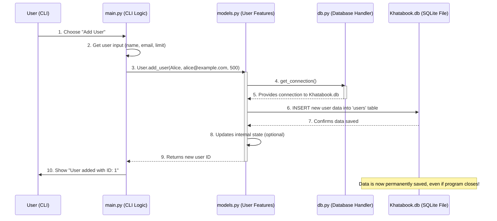

# Chapter 2: Data Persistence Layer

Welcome back! In Chapter 1: System Configuration, we learned how to easily set up and customize our Khatabook system's behavior by changing settings in `config.py`. We saw how `config.py` acts like the "settings menu" of our application, allowing us to define things like email server details and reminder timings.

But what about the actual information our system needs to remember? Where do we store details like:
*   Who are the users in our Khatabook?
*   How much credit has each person taken?
*   When are their payments due?
*   Which reminders have already been sent?

If we just kept this information in our program's memory while it's running, it would all disappear the moment we close the program! That's like writing down your contacts on a piece of paper, but then throwing the paper away every time you close your phone's contacts app. Not very useful, right?

## The Problem: Remembering Information Permanently

Imagine you add a new user to the Khatabook system using the command line:

```
Enter name: Alice Wonderland
Enter email: alice@example.com
Enter max credit limit: 500
```

If the system doesn't save this information, Alice's details would be gone the moment the program closes. This means the next time you open the Khatabook system, it would have forgotten all about Alice!

## The Solution: Data Persistence Layer

This is where the **Data Persistence Layer** comes in. Think of it as the application's long-term memory or its dedicated "filing cabinet." Its main job is to **store all critical information permanently** so that it's still there even after the program has been closed and reopened.

In our Khatabook system, this "memory bank" uses a special kind of file called a **database**. Specifically, we use **SQLite**, which is a very lightweight and popular database technology.

### What is a Database?

At its simplest, a database is just an organized collection of information. You can think of it like a set of very smart spreadsheets, all stored in one file.

*   **Tables:** Instead of sheets, databases have "tables." Each table is like a single spreadsheet, with rows and columns. For example, we might have a `users` table, a `credits` table, and a `notifications` table.
*   **Rows:** Each row in a table represents a single item or record (e.g., one user, one credit transaction, one notification).
*   **Columns:** Each column defines a specific piece of information about that item (e.g., a user's `name`, `email`, or `max_credit_limit`).

### Why SQLite?

SQLite is fantastic for projects like Khatabook because:
*   **File-based:** The entire database is stored in a single file on your computer (like `Khatabook.db`). You don't need to install a separate "database server."
*   **Lightweight:** It doesn't use much memory or processing power, making it fast and efficient for smaller applications.
*   **Easy to Use:** Python has built-in support for SQLite, making it very straightforward to work with.

## How the Data Persistence Layer Works

The Data Persistence Layer in our Khatabook system handles several key tasks:

1.  **Connecting to the Database:** It opens the `Khatabook.db` file when the program needs to read or write data.
2.  **Setting up Tables:** It makes sure that the necessary tables (`users`, `credits`, `notifications`) exist in the database. If they don't, it creates them.
3.  **Storing Information (Writing):** It takes new data (like a new user's details) and writes them into the correct table.
4.  **Retrieving Information (Reading):):** It fetches existing data from the tables when the program needs it (e.g., to display a user's balance).
5.  **Updating Information:** It changes existing data in the tables (e.g., updating a user's credit limit).
6.  **Deleting Information:** It removes records from the tables (e.g., deleting a user).
7.  **Backing Up:** It can even create a copy of the entire database file, just in case something goes wrong.

## Solving Our Use Case: Adding a New User

Let's revisit our problem: How does the system remember "Alice Wonderland" after we add her?

When you run the `main.py` file, it presents a menu. If you choose option `1. Add User`:

```
Select option: 1
Enter name: Alice Wonderland
Enter email: alice@example.com
Enter max credit limit: 500
User added with ID: 1
```

Behind the scenes, the `main.py` program tells the `User` part of our system (defined in `models.py`) to add this user. The `User` part then uses the Data Persistence Layer (`db.py`) to save Alice's information into the database.

Here's a simplified look at the `main.py` part:

```python
# --- File: main.py ---
# ... other imports and functions ...
from db import setup_database # <--- We need to set up the database
from models import User      # <--- We'll use the User features

def main():
    setup_database() # <--- First, make sure the database and tables are ready

    while True:
        # ... other menu choices ...
        elif choice == '1':
            name = input("Enter name: ")
            email = input("Enter email: ")
            max_limit = float(input("Enter max credit limit: "))
            try:
                user_id = User.add_user(name, email, max_limit) # <--- Call User to add data
                print(f"User added with ID: {user_id}")
            except Exception as e:
                print(f"Error adding user: {e}")
        # ... rest of the menu ...
```

When you select `1. Add User`, `main.py` collects the name, email, and limit, then calls `User.add_user()`. This function (`User.add_user`) is where the magic happens, connecting to the database to store the information.

### What Happens Under the Hood?

Let's trace how Alice's details get saved permanently.



1.  **You (the User)** interact with `main.py` through the command line and choose to add a user.
2.  `main.py` gathers the user's name, email, and credit limit.
3.  `main.py` then calls `User.add_user()`, passing these details. This `User.add_user()` function is defined in `models.py`.
4.  Inside `User.add_user()`, it first asks the `db.py` file for a "connection" to the `Khatabook.db` database. Think of this as getting a key to open the filing cabinet.
5.  `db.py` provides this connection.
6.  `User.add_user()` then uses this connection to send a special instruction (called an SQL query) to the `Khatabook.db` file. This instruction tells the database to `INSERT` (add) Alice's details into the `users` table.
7.  The database processes this instruction and confirms that the data has been saved.
8.  `User.add_user()` completes its task and returns the new user's ID.
9.  `main.py` then prints a confirmation message to you.

Crucially, because this data was written to the `Khatabook.db` file, it **persists**. It means it's saved on your hard drive, just like a document you save in Microsoft Word.

### Looking at the Code for Data Persistence

Let's see how `db.py` and `models.py` handle this.

First, the `db.py` file is our direct interface with the SQLite database.

```python
# --- File: db.py ---
import sqlite3
from contextlib import closing
from config import DB_NAME # <--- We get the database name from config.py

def get_connection():
    # This function opens the database file.
    # It uses DB_NAME, which is 'Khatabook.db' from config.py
    return sqlite3.connect(DB_NAME)

def setup_database():
    # This function creates tables if they don't exist.
    # The 'with closing' part makes sure the connection is closed cleanly.
    with closing(get_connection()) as conn:
        c = conn.cursor() # A cursor is like a pen to write or read from the database

        # Create 'users' table if it doesn't exist.
        # It defines columns like id, name, email, etc.
        c.execute('''
        CREATE TABLE IF NOT EXISTS users (
            id INTEGER PRIMARY KEY AUTOINCREMENT,
            name TEXT NOT NULL,
            email TEXT NOT NULL UNIQUE,
            max_credit_limit REAL NOT NULL,
            current_balance REAL NOT NULL DEFAULT 0,
            bad_debt_flag INTEGER DEFAULT 0
        )''')

        # Create 'credits' table if it doesn't exist.
        # FOREIGN KEY links credits to a user in the 'users' table.
        c.execute('''
        CREATE TABLE IF NOT EXISTS credits (
            id INTEGER PRIMARY KEY AUTOINCREMENT,
            user_id INTEGER NOT NULL,
            amount REAL NOT NULL,
            credit_date TEXT NOT NULL,
            due_date TEXT NOT NULL,
            paid INTEGER NOT NULL DEFAULT 0,
            overdue INTEGER NOT NULL DEFAULT 0,
            FOREIGN KEY(user_id) REFERENCES users(id)
        )''')

        # Create 'notifications' table if it doesn't exist.
        c.execute('''
        CREATE TABLE IF NOT EXISTS notifications (
            id INTEGER PRIMARY KEY AUTOINCREMENT,
            user_id INTEGER NOT NULL,
            credit_id INTEGER,
            notification_type TEXT NOT NULL,
            sent_date TEXT NOT NULL,
            status TEXT NOT NULL,
            FOREIGN KEY(user_id) REFERENCES users(id),
            FOREIGN KEY(credit_id) REFERENCES credits(id)
        )''')

        conn.commit() # Save all changes to the database file
```

*   `DB_NAME` comes from `config.py` (which is `Khatabook.db` by default), so the database file name can be easily changed.
*   `get_connection()` gives us the way to talk to the database file.
*   `setup_database()` is run at the very beginning of the program (in `main.py`) to make sure that the `users`, `credits`, and `notifications` tables are ready. If they already exist, it does nothing; if not, it creates them. The `CREATE TABLE IF NOT EXISTS` command is key here.

Now, let's look at the `User.add_user()` function in `models.py`:

```python
# --- File: models.py ---
# ... other imports ...
from db import get_connection # <--- Need to get a database connection

class User:
    # ... __init__ and other methods ...

    @staticmethod
    def add_user(name, email, max_credit_limit):
        # We get a connection to the database
        with get_connection() as conn:
            cur = conn.cursor() # Get the 'pen' to write commands

            # This is the SQL command to insert data into the 'users' table.
            # The '?' are placeholders for our Python variables.
            cur.execute("INSERT INTO users (name, email, max_credit_limit, current_balance) VALUES (?, ?, ?, 0)",
                        (name, email.lower(), max_credit_limit))
            
            conn.commit() # Save the changes to the database file!
            return cur.lastrowid # Get the ID of the newly added user
```

*   `User.add_user()` calls `get_connection()` from `db.py` to get access to the database.
*   `cur.execute(...)` is the line that actually runs a SQL command. `INSERT INTO users (...) VALUES (?, ?, ?, 0)` tells the database to put a new row into the `users` table. The `(?)` are filled in by the values in the tuple `(name, email.lower(), max_credit_limit)`.
*   `conn.commit()` is extremely important! It saves all the changes you've made (like adding a new user) permanently to the `Khatabook.db` file. Without `commit()`, your changes would only be temporary and would be lost.

### Database Backup

Another crucial task of the Data Persistence Layer is **backing up** your data. Just like you back up important documents, it's good practice to back up your database file.

Our system has a `backup_database` function in `db.py`:

```python
# --- File: db.py ---
# ... other functions ...
from config import BACKUP_PATH # <--- Backup path from config.py

def backup_database(backup_path):
    # This copies the entire database to a new file.
    with closing(get_connection()) as conn, open(backup_path, 'wb') as f:
        # iterdump() reads the entire database content and writes it to the backup file
        for line in conn.iterdump():
            f.write(f"{line}\n".encode())
```

And you can trigger this from `main.py` using option `8. Backup Database`:

```python
# --- File: main.py ---
# ...
from config import BACKUP_PATH # <--- The path for the backup comes from config.py
from db import backup_database # <--- The function that does the backup

def main():
    # ...
    elif choice == '8':
        try:
            backup_database(BACKUP_PATH) # <--- Call the backup function
            print(f"Database backed up to {BACKUP_PATH}")
        except Exception as e:
            print(f"Backup failed: {e}")
    # ...
```

This ensures that a copy of your `Khatabook.db` file is saved to the location specified in `config.py` (e.g., `backup/Khatabook_backup.db`), giving you a safety net for your important data.

## Conclusion

The Data Persistence Layer is the backbone of our Khatabook system's memory. By using **SQLite** and organizing information into **tables**, it ensures that all user details, credit records, and notification logs are stored permanently in the `Khatabook.db` file. This means that even if you close the program, your data is safe and ready for you the next time you open it. It handles everything from creating the database tables to securely saving and even backing up your precious information.

Next, we'll dive into how the system actually sends those automated reminders and notifications, by exploring the Email Notification Service
