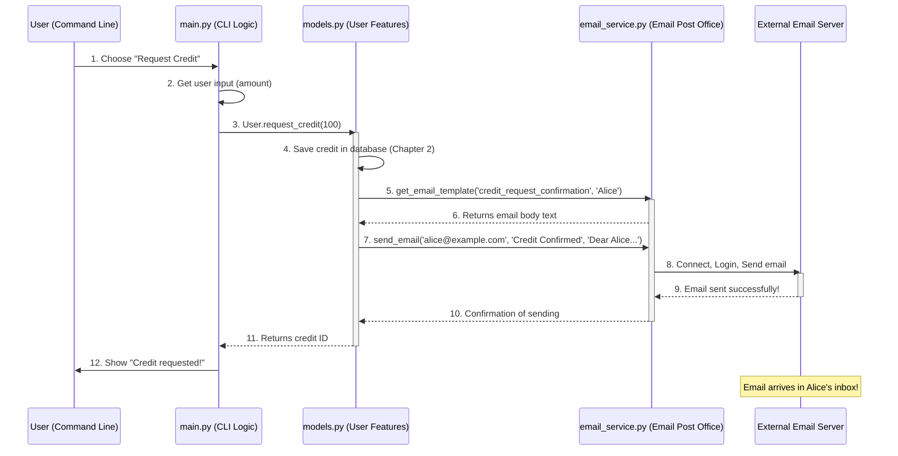

# Chapter 3: Email Notification Service

Welcome back! In Chapter 1: System Configuration, we learned how `config.py` lets us set up important details like which email server to use. Then, in Chapter 2: Data Persistence Layer, we explored how our Khatabook system remembers important information, like who owes what, by saving it in a database file.

Now, imagine our system has successfully saved a new credit request for a user. How does it tell that user, "Good news! Your credit has been approved!"? Or, even more importantly, how does it send a gentle nudge (or a strong warning!) when a payment is due or overdue?

If every part of our system tried to send emails directly, it would be like every person in a big office trying to be their own mail carrier. It would be messy, complicated, and hard to manage!

## The Problem: Sending Emails Reliably

Our Khatabook system needs to send various types of email messages:

*   **Confirmations:** "Your credit request is approved!"
*   **Reminders:** "Your payment is due soon!"
*   **Warnings:** "Your payment is overdue!"
*   **Alerts:** "Bad debt detected!"

Each of these messages needs to be created, addressed, and sent out through an email server. This process involves technical details like connecting to the server, logging in securely, and formatting the message correctly. If we scatter this email-sending code everywhere, it becomes:

*   **Hard to change:** If the email server details (like password) change, you'd have to find and update many places in the code.
*   **Hard to test:** It's tough to make sure emails are always sent correctly from every part of the system.
*   **Repetitive:** You'd be writing the same email sending logic over and over again.

## The Solution: Email Notification Service

This is where the **Email Notification Service** comes in. Think of it as the system's dedicated **"post office"**. Its one and only job is to handle all things related to sending emails.

Just like a real post office, it:

1.  **Takes your message:** You tell it *what* message to send and *to whom*.
2.  **Packs it neatly:** It prepares the email using proper formats and templates.
3.  **Handles the delivery:** It knows how to connect to the email server and send the message out, taking care of all the complex technical steps.

This service isolates all the email-sending complexity into one central place. This means other parts of our system (like the part that handles credit requests or the part that checks for overdue payments) don't need to know *how* to send an email; they just need to tell the Email Notification Service, "Please send this message to that person!"

### Solving Our Use Case: Sending a Credit Request Confirmation

Let's look at a key example: When a user successfully requests a new credit, the system should automatically send them a confirmation email.

Here's how other parts of the system use the Email Notification Service to achieve this:

## How to Use the Email Notification Service

The Email Notification Service is primarily handled by the `email_service.py` file. Other parts of the Khatabook system simply "call" functions from this file when they need to send an email.

Consider the `User` class in `models.py`. When a user requests credit, after saving the credit details to the database (as we learned in Chapter 2), it calls the email service:

```python
# --- File: models.py ---
# ... other imports ...
from email_service import send_email, get_email_template # <--- We import the functions we need!

class User:
    # ... other methods ...

    def request_credit(self, amount):
        # ... (logic to check limit and save credit to database) ...

        # --- This is where we use the Email Notification Service! ---
        subject = "Credit Request Confirmation"
        # get_email_template prepares the message using a predefined text
        body = get_email_template('credit_request_confirmation', self.name)
        # send_email actually dispatches the email
        send_email(self.email, subject, body)
        return credit_id
```

In this simplified code snippet from `models.py`:

1.  `from email_service import send_email, get_email_template`: This line is like saying, "Hey, I need the `send_email` and `get_email_template` tools from our `email_service` toolbox!"
2.  `subject = "Credit Request Confirmation"`: We decide what the email's subject line should be.
3.  `body = get_email_template('credit_request_confirmation', self.name)`: We use `get_email_template` to get a ready-made message. We tell it what `type` of notification we want (`'credit_request_confirmation'`) and who the `user_name` is, so it can personalize the message.
4.  `send_email(self.email, subject, body)`: Finally, we call `send_email`. We give it:
    *   `self.email`: The email address of the person we're sending to.
    *   `subject`: The email's subject line.
    *   `body`: The content of the email message.

And that's it! The `models.py` file doesn't need to worry about SMTP servers or passwords; it just tells the Email Notification Service what to send, and the service handles the rest.

## What Happens Under the Hood?

Let's see the journey of an email from being triggered to being sent.



1.  **You (the User)** interact with `main.py` (the Command Line Interface) and choose to request credit.
2.  `main.py` asks for the credit amount.
3.  `main.py` then calls `User.request_credit()` in `models.py`.
4.  Inside `User.request_credit()`, it first saves the new credit record to the database (as discussed in Chapter 2).
5.  Then, it asks `email_service.py` to `get_email_template()` for the confirmation message.
6.  `email_service.py` returns the formatted message body.
7.  Next, `User.request_credit()` tells `email_service.py` to `send_email()`, providing the recipient, subject, and body.
8.  `email_service.py` takes these details, connects to the `External Email Server` (like Gmail's server), logs in, and dispatches the email.
9.  The `External Email Server` confirms that the email has been sent.
10. `email_service.py` reports back to `User.request_credit()`.
11. Finally, `User.request_credit()` completes its task and `main.py` shows a success message to you.

### Diving into the `email_service.py` Code

Let's see how the `email_service.py` file actually performs its "post office" duties.

First, it needs all those important settings (like the SMTP server address and login details) that you set up in `config.py` (remember Chapter 1?).

```python
# --- File: email_service.py ---
import smtplib # This is Python's built-in email sending library
from email.mime.text import MIMEText # Helps create the text part of the email
from email.mime.multipart import MIMEMultipart # Helps create a complete email message

# --- Importing our email settings from config.py! ---
from config import SMTP_SERVER, SMTP_PORT, SMTP_USERNAME, SMTP_PASSWORD, FROM_EMAIL

def send_email(to_email, subject, body):
    try:
        message = MIMEMultipart() # Create a new email message
        message['From'] = FROM_EMAIL # Set the sender email (from config.py)
        message['To'] = to_email     # Set the recipient
        message['Subject'] = subject # Set the subject

        message.attach(MIMEText(body, 'plain')) # Add the message body

        # --- Connect to the email server and send the email ---
        with smtplib.SMTP(SMTP_SERVER, SMTP_PORT) as server:
            server.starttls() # Secure the connection
            server.login(SMTP_USERNAME, SMTP_PASSWORD) # Log in to the email account
            server.sendmail(FROM_EMAIL, to_email, message.as_string()) # Send the email!

        return True, None # Success!
    except Exception as e:
        return False, str(e) # Oh no, something went wrong
```

Here's what each key part of `send_email` does:

*   `from config import ...`: This brings in all the details like `SMTP_SERVER` (e.g., `'smtp.gmail.com'`), `SMTP_PORT` (e.g., `587`), `SMTP_USERNAME` (your email), `SMTP_PASSWORD` (your email's password), and `FROM_EMAIL` (the sender's visible email address). This is why changing your email settings in `config.py` works seamlessly!
*   `message = MIMEMultipart()`: This creates an empty email message "envelope."
*   `message['From'] = FROM_EMAIL`: It stamps the "From" address on the envelope.
*   `with smtplib.SMTP(SMTP_SERVER, SMTP_PORT) as server:`: This line opens a connection to the email server using the details from `config.py`.
*   `server.starttls()`: This encrypts the connection, making sure your login details and message are sent securely.
*   `server.login(SMTP_USERNAME, SMTP_PASSWORD)`: This uses your email username and password (from `config.py`) to log into the email server.
*   `server.sendmail(FROM_EMAIL, to_email, message.as_string())`: This is the final step where the email is actually sent!

### Email Templates

The Email Notification Service also has a handy feature: `get_email_template`. This function acts like a "fill-in-the-blanks" form for common messages. Instead of writing the full message every time, you just pick a template, and it fills in the specific details like the user's name or due date.

```python
# --- File: email_service.py ---
# ... other imports and send_email function ...

def get_email_template(notification_type, user_name, due_date=None, amount=None):
    if notification_type == 'credit_request_confirmation':
        return (f"Dear {user_name},\n\n"
                "Your credit request has been approved and credited to your account.\n\n"
                "Thank you,\nKhatabook Team")
    elif notification_type == 'overdue_alert':
        return (f"Dear {user_name},\n\n"
                f"Your credit due on {due_date} is overdue. Please settle the amount of {amount} immediately.\n\n"
                "Thank you,\nKhatabook Team")
    # ... other template types would go here ...
    else:
        return "Notification from Khatabook."
```

When `models.py` calls `get_email_template('credit_request_confirmation', self.name)`, this function looks at the `notification_type` and gives back the corresponding message with the `user_name` filled in. This ensures all our messages are consistent and easy to manage.

## Why a Separate Service?

Having a dedicated "Email Notification Service" offers big advantages:

| Without Email Notification Service | With Email Notification Service |
| :--------------------------------- | :------------------------------ |
| Email sending logic scattered everywhere. | All email sending logic in one place (`email_service.py`). |
| Hard to change email server details (need to update many files). | Easy to change email server details (just update `config.py`). |
| Difficult to test if all emails send correctly. | Easy to test email sending in one go. |
| Each part of the system needs to know *how* to send emails. | Other parts just say *what* email to send; the service handles *how*. |
| Less reliable and prone to errors. | More reliable and consistent communication. |

It makes our `Khatabook Auto Reminder System` cleaner, easier to understand, and much simpler to maintain or update.

## Conclusion

The Email Notification Service, encapsulated in `email_service.py`, acts as the centralized "post office" for our Khatabook system. It efficiently handles all the complexities of sending emails, from preparing messages using templates to connecting securely with external email servers. By isolating this functionality, it ensures reliable and consistent communication for confirmations, reminders, and alerts, making the rest of the system simpler and more focused on its main jobs.

Next, we'll dive into the heart of our application – the actual rules and operations that govern credit, users, and transactions.

---
