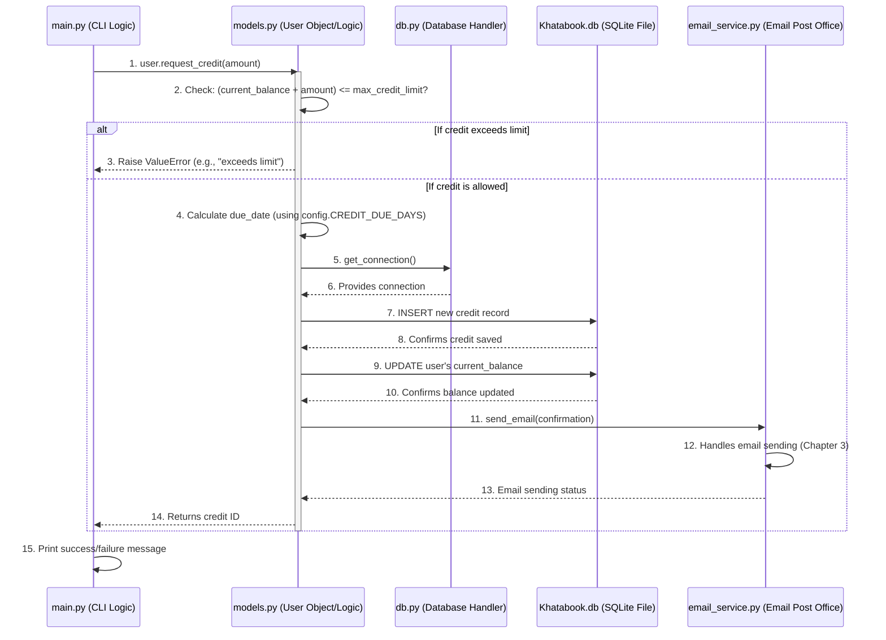

# Chapter 4: Core Business Logic

Welcome back! In our journey to understand the `Khatabook Auto Reminder System`, we've already covered some crucial parts:
*   In *Chapter 1: System Configuration*, we learned about `config.py` as the system's "settings menu."
*   In *Chapter 2: Data Persistence Layer*, we saw how `db.py` and SQLite permanently store all our users and credit information.
*   In *Chapter 3: Email Notification Service*, we explored how `email_service.py` acts as our dedicated "post office" for sending messages.

Now, imagine our system has all its settings defined and a reliable way to save data and send emails. But how does it actually *decide* what to do? How does it know:
*   If a user can even *request* a certain amount of credit?
*   How to calculate when a payment is actually *due*?
*   What happens when a credit is *paid*?
*   How to identify accounts that are truly problematic ("bad debt")?

If we just had data storage and email sending, the system wouldn't have any intelligence. It would be like a car with an engine and a fuel tank, but no steering wheel or brakes!

## The Problem: Defining the Rules of the Game

Without clear rules, our Khatabook system would be chaotic. We need a central place to define all the "laws" that govern how users, credits, and payments interact. For example:

*   **Rule 1: Credit Limit Check:** A user should *never* be able to take credit that makes their total outstanding balance go beyond their pre-set `max_credit_limit`.
*   **Rule 2: Payment Due Date:** Every credit should have a clear due date, typically a fixed number of days after the credit is taken.
*   **Rule 3: Balance Update:** When a user takes credit, their `current_balance` must increase. When they pay, it must decrease.
*   **Rule 4: Bad Debt Identification:** If a credit is overdue for too long, the user should be flagged as having "bad debt."

If these rules were scattered across different parts of the code, it would be easy to make mistakes, leading to incorrect balances or missed alerts. It would be like a bank where different tellers follow different rules for loans!

## The Solution: Core Business Logic

This is where the **Core Business Logic** comes in. Think of it as the **"brain"** of our Khatabook system. It's the part that knows all the rules, performs calculations, and decides how data should change based on actions.

In our project, this "brain" primarily lives in the `models.py` file. This file contains "models" which are like blueprints for the main things our system deals with, primarily `User` and `Credit` (although `Credit` is managed *through* `User` methods in this structure).

The Core Business Logic is responsible for:

*   **Enforcing Rules:** Like ensuring a user doesn't exceed their credit limit.
*   **Calculations:** Such as figuring out a due date or updating balances.
*   **Orchestrating Actions:** Deciding when to save data to the database or send an email.

## Solving Our Use Case: Requesting Credit with a Limit Check

Let's focus on a specific example: **How does the system allow a user to request credit, but only if they don't exceed their maximum limit?**

When you interact with the system via `main.py` and choose to "Request Credit" (option 4):

```
Select option: 4
Enter user ID to request credit: 1
Enter credit amount: 50
Credit granted with ID 123
```

Or, if the request goes over the limit:

```
Select option: 4
Enter user ID to request credit: 1
Enter credit amount: 1000
Credit request failed: Credit request exceeds max credit limit (500.0)
```

The Core Business Logic is what makes this decision.

## How to Use the Core Business Logic

The `main.py` file (our Command Line Interface) doesn't know the intricate rules of credit limits. It simply tells the `User` object (which represents a user in our system), "Hey, this user wants to request this much credit." The `User` object, containing the Core Business Logic, then figures out if it's allowed.

Here's a simplified view of `main.py` calling the `User` object:

```python
# --- File: main.py ---
# ... other imports ...
from models import User # <--- We need the User blueprint

def main():
    # ... other menu choices ...
    elif choice == '4':
        user_id = int(input("Enter user ID to request credit: "))
        user = User.get_user_by_id(user_id) # Get the User object for this ID
        if not user:
            print("User not found")
            continue
        amount = float(input("Enter credit amount: "))
        try:
            # --- This is where main.py tells the User object to handle the request! ---
            credit_id = user.request_credit(amount)
            print(f"Credit granted with ID {credit_id}")
        except Exception as e:
            print(f"Credit request failed: {e}")
    # ... rest of the menu ...
```

In this code:
*   `user = User.get_user_by_id(user_id)`: We first get the specific `User` object from the database using its ID. This `user` object now "knows" its `max_credit_limit` and `current_balance`.
*   `credit_id = user.request_credit(amount)`: We then call the `request_credit` "method" on that `user` object. This method contains the actual business logic to check the limit, calculate the due date, save the credit, and update the balance.

## What Happens Under the Hood?

Let's trace the steps when `user.request_credit(amount)` is called.



1.  `main.py` calls the `request_credit` method on a `User` object.
2.  The `User` object, within its `request_credit` method, first checks if the requested `amount` would make the `current_balance` exceed the `max_credit_limit`. This is a core business rule.
3.  **If it exceeds:** The `User` object immediately stops and tells `main.py` about the error.
4.  **If it's allowed:** The `User` object proceeds to calculate the `due_date` for this new credit (it uses `CREDIT_DUE_DAYS` from `config.py`).
5.  It then uses `db.py` to get a connection to the database.
6.  It sends an `INSERT` command to the database to add the new credit record.
7.  It also sends an `UPDATE` command to the database to increase the user's `current_balance`.
8.  Finally, it tells the `email_service.py` to send a confirmation email to the user.
9.  After all these steps are successful, the `User` object tells `main.py` that the credit was granted, providing the new credit's ID.

### Diving into the `models.py` Code

Let's look at the `models.py` file, which is where this core business logic resides.

```python
# --- File: models.py ---
import datetime
from db import get_connection # To interact with the database
from email_service import send_email, get_email_template # To send emails
from config import CREDIT_DUE_DAYS # <--- Crucial setting from config.py

DATE_FORMAT = "%Y-%m-%d"

class User:
    # ... __init__ and other methods ...

    def can_request_credit(self, amount):
        # Business Rule 1: Check if new credit exceeds max limit
        return (self.current_balance + amount) <= self.max_credit_limit

    def request_credit(self, amount):
        # Enforce Rule 1: If not allowed, stop and raise error
        if not self.can_request_credit(amount):
            raise ValueError(f"Credit request exceeds max credit limit ({self.max_credit_limit})")

        # Business Rule 2: Calculate due date
        credit_date = datetime.date.today()
        # CREDIT_DUE_DAYS comes from config.py (e.g., 30 days)
        due_date = credit_date + datetime.timedelta(days=CREDIT_DUE_DAYS)

        with get_connection() as conn:
            cur = conn.cursor()
            # Orchestration: Save new credit to database (Chapter 2)
            cur.execute("INSERT INTO credits (user_id, amount, credit_date, due_date, paid, overdue) VALUES (?, ?, ?, ?, 0, 0)",
                        (self.id, amount, credit_date.strftime(DATE_FORMAT), due_date.strftime(DATE_FORMAT)))
            credit_id = cur.lastrowid # Get the ID of the new credit

            # Business Rule 3: Update user's current balance
            self.current_balance += amount
            # Orchestration: Save updated balance to database (Chapter 2)
            cur.execute("UPDATE users SET current_balance=? WHERE id=?", (self.current_balance, self.id))
            conn.commit() # Save changes permanently!

        # Orchestration: Send confirmation email (Chapter 3)
        subject = "Credit Request Confirmation"
        body = get_email_template('credit_request_confirmation', self.name)
        send_email(self.email, subject, body)
        return credit_id

    def pay_credit(self, credit_id):
        # This method also contains business logic for paying credits
        # It checks if credit exists, is unpaid, then updates balance and database
        # ... (simplified for brevity) ...
        pass # Actual implementation would go here

    def flag_bad_debt(self):
        # This method contains business logic for identifying bad debt
        # It checks overdue credits against BAD_DEBT_THRESHOLD_DAYS from config.py
        # ... (simplified for brevity) ...
        pass # Actual implementation would go here
```

Let's break down the key lines in `request_credit`:

*   `from config import CREDIT_DUE_DAYS`: This line brings in the `CREDIT_DUE_DAYS` setting (e.g., `30`) from our `config.py` file. This means if we ever want to change how many days a credit is due, we just change it in `config.py`, not in this complex logic!
*   `if not self.can_request_credit(amount):`: This is the explicit check against the credit limit. If it fails, `raise ValueError` stops the process.
*   `due_date = credit_date + datetime.timedelta(days=CREDIT_DUE_DAYS)`: This line calculates the due date based on the current date and the `CREDIT_DUE_DAYS` setting. This is a core business calculation.
*   `cur.execute("INSERT INTO credits ...")` and `cur.execute("UPDATE users ...")`: These lines are where the business logic *orchestrates* the saving of data to the database, using the `db.py` module (as learned in Chapter 2).
*   `send_email(...)`: This line is where the business logic *orchestrates* sending an email, using the `email_service.py` module (as learned in Chapter 3).

## Why a Separate Core Business Logic Layer?

Having a dedicated `models.py` file for our Core Business Logic offers significant benefits:

| Without Core Business Logic | With Core Business Logic (in `models.py`) |
| :-------------------------- | :---------------------------------------- |
| Business rules are scattered and duplicated. | All fundamental rules and calculations are centralized. |
| Hard to understand how data changes or what rules apply. | Clear definition of how users, credits, and payments behave. |
| Difficult to enforce consistency (e.g., credit limit checks might be missed). | Ensures all operations follow predefined rules consistently. |
| Changes to rules require modifying many parts of the code. | Changes to rules are mostly confined to `models.py`. |
| Hard to test if rules are correctly applied. | Easy to test business rules in isolation. |

It makes our `Khatabook Auto Reminder System` robust, understandable, and maintainable, ensuring that all financial interactions are handled correctly and consistently.

## Conclusion

The Core Business Logic, primarily housed in `models.py`, is the "brain" of our Khatabook system. It defines and enforces all the fundamental rules governing users, credits, and payments, ensuring that operations like requesting credit, making payments, and identifying bad debt always follow the system's predefined policies. By centralizing this logic, we make the system intelligent, consistent, and much easier to manage.

Next, we'll see how this "brain" works with the Email Notification Service and the Data Persistence Layer to automatically send those crucial reminders and monitor debt. Get ready to learn about Automated Reminders & Debt Monitoring
