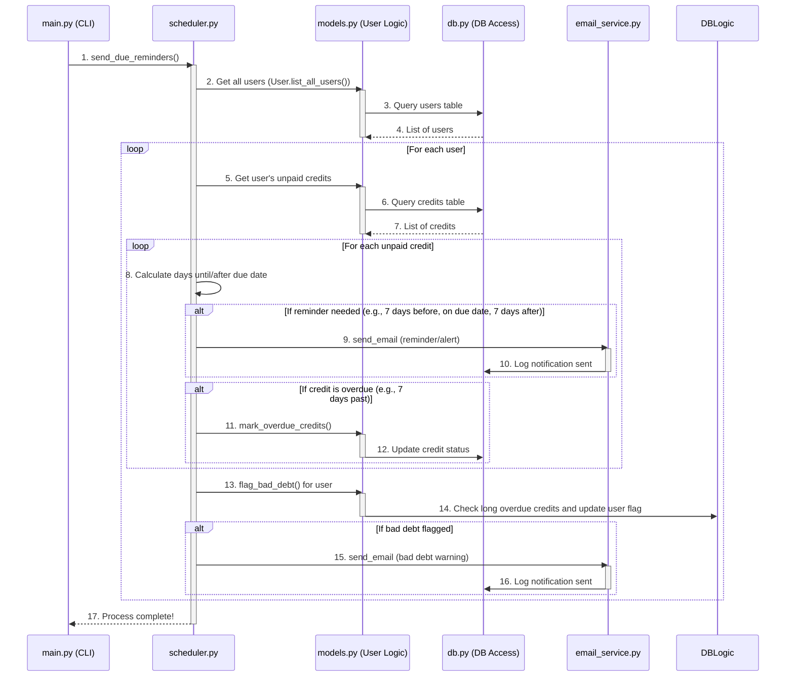

# Chapter 5: Automated Reminders & Debt Monitoring

Welcome back! In our previous chapters, we've built a solid foundation for our Khatabook system:
*   In Chapter 1: System Configuration, we learned how to set up the system's "settings" in `config.py`.
*   In Chapter 2: Data Persistence Layer, we discovered how `db.py` helps our system "remember" all its data permanently in `Khatabook.db`.
*   In Chapter 3: Email Notification Service, we explored our dedicated "post office" (`email_service.py`) for sending emails.
*   And in Chapter 4: Core Business Logic, we saw how `models.py` acts as the "brain," holding all the rules for managing users and credits.

Now, imagine you've set up all your users and recorded their credits. But how do you make sure people actually *pay back* their debts on time? Do you have to manually check every single credit every single day? That sounds like a lot of work! What if you forget to remind someone, and they never pay?

## The Problem: Manual Debt Chasing

Keeping track of who owes what, when it's due, and sending reminders can be a huge headache for even a few people. As the number of users and credit transactions grows, this manual process becomes:

*   **Time-Consuming**: You'd spend hours checking dates and sending emails.
*   **Error-Prone**: You might accidentally miss a due date or send a reminder to the wrong person.
*   **Ineffective**: Without timely nudges, people might genuinely forget, leading to delayed payments or even "bad debt" (money that's very unlikely to be repaid).

We need a way for the system to do this automatically, without needing someone to constantly monitor it.

## The Solution: Automated Reminders & Debt Monitoring

This is where the **Automated Reminders & Debt Monitoring** component shines. Think of it as your system's **"automated financial assistant."** Its primary job is to periodically (meaning, every now and then) check all outstanding credits and user statuses.

Here's what this assistant does:

*   **Proactive Reminders**: It automatically sends friendly reminders for payments that are *coming soon*.
*   **Overdue Alerts**: If a payment passes its due date, it sends a stronger alert.
*   **Bad Debt Flagging**: For credits that are significantly overdue (e.g., months without payment), it identifies and flags these users as having "bad debt," allowing you to take further action.

This crucial component works quietly in the background, proactively preventing bad debt and keeping users informed about their financial obligations within the system, all without any manual intervention once set up!

## How to Use the Automated Reminders

In our Khatabook system, the `main.py` file (our Command Line Interface) has an option that tells this "automated financial assistant" to get to work.

When you run `main.py`, you'll see an option:

```
6. Send Due Reminders
```

When you select this option:

```
Select option: 6
Sending due reminders...
Reminders sent
```

This single command triggers the entire automated reminder and debt monitoring process. The system then goes through all users and their credits, performs checks, and sends out emails where necessary, and updates its records in the database. You don't see the individual emails being sent or the checks being made; you just get a confirmation that the process has run.

## What Happens Under the Hood?

Let's trace what happens when you select "Send Due Reminders" in `main.py`. The magic here largely happens in a file called `scheduler.py`. This file contains the instructions for our "automated financial assistant."



Here's a step-by-step breakdown:

1.  **You (via `main.py`)** tell the `Scheduler` to `send_due_reminders()`.
2.  The `Scheduler` (`scheduler.py`) first asks the `UserLogic` (`models.py`) to give it a list of all active users.
3.  For each user, the `Scheduler` then asks the `UserLogic` for their outstanding (unpaid) credits.
4.  Now, for each unpaid credit, the `Scheduler` calculates how many days are left until the due date, or how many days it has been overdue.
5.  Based on these calculations and settings from `config.py` (like `REMINDER_DAYS_BEFORE`), it decides if a reminder email should be sent. If yes, it tells the `EmailService` (`email_service.py`) to send an email, and the `EmailService` also records this in the database (`db.py`) via `NotificationLog`.
6.  If a credit is past its due date, the `Scheduler` tells the `UserLogic` to `mark_overdue_credits()` in the database.
7.  After checking all credits for a user, the `Scheduler` tells the `UserLogic` to `flag_bad_debt()` for that user. This checks if any of their debts are very old and overdue (based on `BAD_DEBT_THRESHOLD_DAYS` from `config.py`).
8.  If a user is flagged with bad debt, the `Scheduler` sends a special "bad debt warning" email.
9.  This process repeats for every user until all checks are done.
10. Finally, the `Scheduler` tells `main.py` that it's `Reminders sent!`.

### Diving into the Code

Let's look at the key parts in `scheduler.py` and `models.py` that make this happen.

First, the `scheduler.py` file orchestrates the entire process:

```python
# --- File: scheduler.py ---
import datetime
from models import User, NotificationLog # To get user/credit data, and log notifications
from email_service import send_email, get_email_template # To send emails
# --- Important settings for reminder timings ---
from config import REMINDER_DAYS_BEFORE, REMINDER_DAYS_AFTER, CREDIT_DUE_DAYS 

DATE_FORMAT = "%Y-%m-%d"

def send_due_reminders():
    today = datetime.date.today()
    users = User.list_all_users() # 1. Get all users from the database

    for user in users:
        # Get all unpaid credits for the current user
        # (This uses the database via User model methods)
        credits = user.get_unpaid_credits() # Simplified: A new method in User class

        for credit in credits:
            credit_id, amount, due_date_str, paid, overdue = credit
            due_date = datetime.datetime.strptime(due_date_str, DATE_FORMAT).date()
            days_diff = (due_date - today).days # Calculate difference in days

            # --- Logic for sending various reminders ---
            if days_diff == REMINDER_DAYS_BEFORE:
                # Example: If due in 7 days, send a reminder
                send_notification(user, credit_id, 'due_soon_reminder', due_date_str, amount)
            elif days_diff == 0:
                # Example: If due today, send a reminder
                send_notification(user, credit_id, 'due_today_reminder', due_date_str, amount)
            elif days_diff == -REMINDER_DAYS_AFTER: # Note the negative sign here
                # Example: If overdue by 7 days
                user.mark_overdue_credits() # Mark it overdue in DB (if not already)
                send_notification(user, credit_id, 'overdue_alert', due_date_str, amount)
            # ... (other reminder logic could go here) ...

        # --- Logic for checking and flagging bad debt ---
        bad_debt_flag = user.flag_bad_debt() # Check and update bad debt status in DB
        if bad_debt_flag:
            subject = "Bad Debt Warning"
            body = get_email_template('bad_debt_warning', user.name)
            success, error = send_email(user.email, subject, body)
            NotificationLog.log_notification(user.id, 'bad_debt_warning', status='sent' if success else f'failed: {error}')

# Helper function to send and log any notification
def send_notification(user, credit_id, notification_type, due_date, amount):
    subject = f"Khatabook: Your Credit Notification ({notification_type.replace('_', ' ').title()})"
    body = get_email_template(notification_type, user.name, due_date, amount)
    success, error = send_email(user.email, subject, body)
    # Log the notification status (sent or failed) in the database
    NotificationLog.log_notification(user.id, notification_type, credit_id, status='sent' if success else f'failed: {error}')
```

*   `from config import REMINDER_DAYS_BEFORE, REMINDER_DAYS_AFTER, CREDIT_DUE_DAYS`: These values, which you can easily change in `config.py`, directly control *when* reminders are sent. For example, if `REMINDER_DAYS_BEFORE` is 7, the system sends a reminder when `days_diff` is `7`.
*   `User.list_all_users()`: This gets all users, allowing the scheduler to check everyone.
*   `user.get_unpaid_credits()`: This (a method within the `User` class in `models.py`) fetches all credits that a user hasn't paid yet.
*   `days_diff = (due_date - today).days`: This simple calculation is at the heart of timing the reminders.
*   `send_notification(...)`: This is a helper function that uses our Email Notification Service (`send_email` and `get_email_template`) and also logs the notification using `NotificationLog` (from `models.py`) so we have a record.
*   `user.mark_overdue_credits()` and `user.flag_bad_debt()`: These are calls to the Core Business Logic in `models.py`, which updates the database.

Now, let's peek at the `models.py` file again to see how `User.mark_overdue_credits()` and `User.flag_bad_debt()` actually work:

```python
# --- File: models.py ---
import datetime
from db import get_connection # To interact with the database
# ... other imports ...
from config import BAD_DEBT_THRESHOLD_DAYS # Important setting for bad debt

DATE_FORMAT = "%Y-%m-%d"

class User:
    # ... __init__ and other methods ...

    # New method added for scheduler to easily get unpaid credits
    def get_unpaid_credits(self):
        with get_connection() as conn:
            cur = conn.cursor()
            cur.execute("""
                SELECT id, amount, due_date, paid, overdue FROM credits
                WHERE user_id=? AND paid=0
            """, (self.id,))
            return cur.fetchall()

    def mark_overdue_credits(self):
        with get_connection() as conn:
            cur = conn.cursor()
            today_str = datetime.date.today().strftime(DATE_FORMAT)
            # Find unpaid credits for this user that are past their due date
            # and mark them as overdue in the database
            cur.execute("""
                UPDATE credits SET overdue=1
                WHERE user_id=? AND overdue=0 AND paid=0 AND due_date < ?
            """, (self.id, today_str))
            conn.commit() # Save changes to the database!

    def flag_bad_debt(self):
        # This function checks if any credit is overdue past the bad debt threshold
        with get_connection() as conn:
            cur = conn.cursor()
            # Calculate the date before which a credit is considered 'bad debt'
            threshold_date = datetime.date.today() - datetime.timedelta(days=BAD_DEBT_THRESHOLD_DAYS)
            threshold_str = threshold_date.strftime(DATE_FORMAT)

            # Count how many of this user's unpaid credits are past the bad debt threshold
            cur.execute("""
                SELECT COUNT(*) FROM credits 
                WHERE user_id=? AND overdue=1 AND paid=0 AND due_date < ?
            """, (self.id, threshold_str))
            count = cur.fetchone()[0] # Get the count

            # Update the user's bad_debt_flag in the database
            if count > 0:
                self.bad_debt_flag = True # Set the flag to True if bad debt exists
            else:
                self.bad_debt_flag = False # Set to False if no bad debt
            cur.execute("UPDATE users SET bad_debt_flag=? WHERE id=?", (1 if self.bad_debt_flag else 0, self.id))
            conn.commit() # Save changes to the database!
            return self.bad_debt_flag # Return the updated flag status
```

*   `mark_overdue_credits()`: This method updates the `credits` table in the database, setting the `overdue` status to `1` for any of the user's unpaid credits that have passed their `due_date`.
*   `flag_bad_debt()`: This method is a crucial piece of debt monitoring. It calculates a `threshold_date` based on `BAD_DEBT_THRESHOLD_DAYS` from `config.py`. It then counts how many of the user's credits are overdue *and* older than this `threshold_date`. If any are found, it sets the `bad_debt_flag` for the user in the `users` table to `1` (True). This allows you to easily identify problematic accounts later on.

All these pieces work together seamlessly to provide the automated monitoring and reminder system.

## Why a Separate Automated Reminders & Debt Monitoring Component?

Having a dedicated part of our system handle these tasks offers significant advantages:

| Without Automated Reminders | With Automated Reminders & Debt Monitoring |
| :-------------------------- | :----------------------------------------- |
| Manual checking of due dates and balances. | Automatic, periodic checks without human effort. |
| Easy to miss reminders or alerts. | Timely, consistent reminders sent automatically. |
| Reactive approach to bad debt (deal with it after it happens). | Proactive prevention of bad debt by identifying issues early. |
| Inconsistent communication with users. | Standardized and consistent email notifications. |
| Time-consuming and inefficient. | Saves time and improves collection efficiency. |

This component transforms our Khatabook system from a simple ledger into an intelligent, proactive financial assistant that helps manage debts effectively.

## Conclusion

The Automated Reminders & Debt Monitoring component, primarily driven by `scheduler.py` and supported by methods in `models.py`, acts as the vigilant "automated financial assistant" of our Khatabook system. By leveraging settings from System Configuration, data from the Data Persistence Layer, and communication via the Email Notification Service, it tirelessly checks outstanding debts, sends timely reminders, and identifies potential bad debt, all without requiring constant manual input. This ensures that the system is not just a record-keeper, but an active tool in maintaining financial health.

Next, we'll bring all these pieces together and see how you, as a user, can interact with the entire system through a simple, user-friendly menu: the Command-Line Interface (CLI)

---
