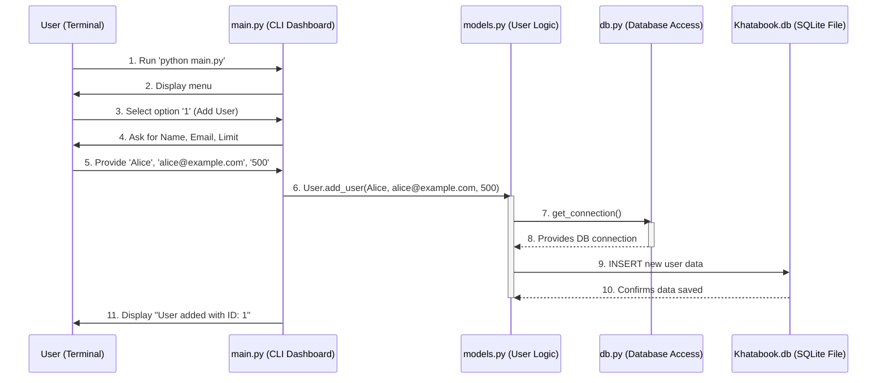

# Chapter 6: Command-Line Interface (CLI)

Welcome back! In our previous chapters, we've built all the powerful internal parts of our `Khatabook Auto Reminder System`:
*   In Chapter 1: System Configuration, we set up the system's "settings."
*   In Chapter 2: Data Persistence Layer, we ensured our system "remembers" everything in a database.
*   In Chapter 3: Email Notification Service, we built our "post office" for sending emails.
*   In Chapter 4: Core Business Logic, we added the "brain" with all the rules for managing users and credit.
*   And in Chapter 5: Automated Reminders & Debt Monitoring, we set up the "automated financial assistant" to send reminders.

Now, imagine you have this amazing car with a powerful engine, a fuel tank, and a smart navigation system. But how do *you* drive it? How do you tell it where to go, or when to turn on the wipers? You need a steering wheel, pedals, and a dashboard, right?

## The Problem: How Do I Talk to My Khatabook System?

We've built a super smart system, but right now, it's like a genius locked in a box. How do you:
*   Add a new user?
*   Record a new credit transaction?
*   Tell the system to send out reminders *right now*?
*   View reports of who owes what?

Without a clear way for a human to interact with it, all that powerful logic and data would just sit there, unused. You wouldn't want to dig into the Python code every time you want to add a new person or request a payment! That's not user-friendly at all.

## The Solution: Command-Line Interface (CLI)

This is where the **Command-Line Interface (CLI)** comes in. Think of the CLI as the **"dashboard"** of our Khatabook system. It's the part that you, the user, directly see and interact with.

Instead of clicking buttons or using a mouse (which would be a Graphical User Interface, or GUI), a CLI lets you interact with the system using **text commands** in a simple window called a "terminal" or "command prompt."

The CLI provides:
*   A **menu of options:** Like "Add User," "Request Credit," "Send Reminders."
*   A way to **take your input:** Like typing a name, an email, or choosing a menu number.
*   A way to **show you information:** Like "User added with ID: 1" or reports.

In our Khatabook project, `main.py` is the file that contains our CLI. When you run `main.py`, it presents this text-based dashboard.

## Solving Our Use Case: Adding a New User via CLI

Let's use our common example: **How do you add a brand new user to the system using the CLI?**

This is usually the very first thing you'd want to do to start using the system.

### How to Use the CLI

To start interacting with the Khatabook system, you open your terminal or command prompt, navigate to the project folder, and run the `main.py` file using Python:

```bash
python main.py
```

Once you run it, you'll immediately see the menu, which is the CLI in action:

```
----------------------------------------
Khatabook Auto Reminder System
----------------------------------------
1. Add User
2. Update User
3. Delete User
4. Request Credit
5. Pay Credit
6. Send Due Reminders
7. Generate Reports
8. Backup Database
9. Exit
Select option:
```

To add a new user, you would follow these steps:

1.  **Type `1`** and press Enter (to select "Add User").
2.  The system will then **ask you for information**:
    ```
    Select option: 1
    Enter name: Alice Wonderland
    Enter email: alice@example.com
    Enter max credit limit: 500
    User added with ID: 1
    ```
    You type "Alice Wonderland" for the name, "alice@example.com" for the email, and "500" for the max credit limit, pressing Enter after each.
3.  The CLI then **confirms** that the user was added and gives you their new ID (`User added with ID: 1`).

That's it! You've just used the CLI to successfully add a user without touching any complex code.

## What Happens Under the Hood?

When you interact with the CLI in `main.py`, it acts as the coordinator. It takes your input and then intelligently calls upon the other parts of the system (our "engine" and "brain") to do the actual work.

Let's trace what happens when you select "1. Add User" and provide the details:



1.  **You (the User)** start `main.py` in your terminal.
2.  `main.py` (the CLI) displays the main menu to you.
3.  **You** choose option `1`.
4.  `main.py` then prompts you to enter the user's name, email, and max credit limit.
5.  **You** type in the details.
6.  `main.py` takes these details and calls `User.add_user()`. This is a function defined in `models.py` (our Core Business Logic), which knows how to actually create a user record.
7.  `User.add_user()` then interacts with `db.py` (our Data Persistence Layer) to get a connection to the `Khatabook.db` database.
8.  It then sends a command to the `Khatabook.db` database to `INSERT` (add) Alice's details into the `users` table.
9.  The database confirms the data is saved permanently.
10. `User.add_user()` finishes its task and returns the new user's ID back to `main.py`.
11. Finally, `main.py` (the CLI) displays the confirmation message to you.

### Diving into the `main.py` Code

Let's look at how `main.py` implements this CLI interaction.

First, the CLI needs to show you the menu. This is handled by a simple function:

```python
# --- File: main.py ---
# ... (other imports) ...

def print_menu():
    print("\n" + "-"*40)
    print("Khatabook Auto Reminder System")
    print("-"*40)
    print("1. Add User")
    print("2. Update User")
    # ... (other menu options) ...
    print("9. Exit")
```
This `print_menu()` function simply prints out all the options you see on the screen.

Then, there's a main loop (`while True`) that continuously shows the menu and waits for your input:

```python
# --- File: main.py ---
import sys
from models import User # We need to use the User features
from db import setup_database # To make sure the database is ready

def main():
    setup_database() # Make sure our database tables are set up first (Chapter 2)

    while True: # This loop keeps the menu running until you choose to exit
        print_menu() # Display the menu
        choice = input("Select option: ").strip() # Wait for you to type a choice

        if choice == '1': # If you chose '1' for "Add User"
            name = input("Enter name: ")
            email = input("Enter email: ")
            max_limit = float(input("Enter max credit limit: "))
            try:
                # Call the User.add_user function from models.py (Chapter 4)
                user_id = User.add_user(name, email, max_limit)
                print(f"User added with ID: {user_id}")
            except Exception as e:
                print(f"Error adding user: {e}")

        # ... (other elif blocks for choices 2-9) ...

        elif choice == '9':
            print("Exiting...")
            sys.exit(0) # Exit the program

        else:
            print("Invalid option. Please try again.")

if __name__ == '__main__':
    main() # Start the CLI when the script is run
```

Let's break down the key parts:

*   `setup_database()`: This is called once at the very beginning to ensure our `Khatabook.db` file and its tables (`users`, `credits`, `notifications`) are ready, as discussed in Chapter 2: Data Persistence Layer.
*   `while True:`: This creates an endless loop, so the menu keeps showing up after each action until you specifically choose `9. Exit`.
*   `choice = input("Select option: ").strip()`: This line waits for you to type something and press Enter. Whatever you type is stored in the `choice` variable. `.strip()` removes any extra spaces.
*   `if choice == '1':`: This checks if you typed `1`. If so, it runs the code inside this block.
*   `name = input("Enter name: ")`: This prompts you for the user's name and stores what you type in the `name` variable. Similar lines get the email and max credit limit.
*   `user_id = User.add_user(name, email, max_limit)`: This is the critical line! `main.py` doesn't know *how* to add a user to the database. Instead, it calls the `add_user` function from the `User` class (which lives in `models.py` and holds our Core Business Logic). It simply passes the user's details to it. The `User.add_user` function then handles all the complex saving to the database.
*   `print(f"User added with ID: {user_id}")`: Once `User.add_user` returns the new user's ID, the CLI prints a friendly confirmation message back to you.

The `main.py` file also has similar `elif` blocks for all other menu options, calling the appropriate functions from `models.py`, `scheduler.py` (for Automated Reminders & Debt Monitoring), or `db.py` (for database backup).

## Why a Separate Command-Line Interface (CLI) Component?

Having a dedicated `main.py` file for our CLI offers big advantages:

| Without CLI | With CLI (`main.py`) |
| :------------------------------ | :------------------------------------ |
| No easy way for users to interact. | Provides a simple, menu-driven dashboard. |
| Requires modifying code for every action. | Users can perform actions with simple text commands. |
| No clear "starting point" for the system. | `main.py` is the single, clear entry point. |
| Hard to understand system capabilities. | Menu clearly lists all available features. |
| Development/testing is more complex. | Makes development modular and testing easier. |

The CLI transforms our powerful internal system into a usable tool, making it accessible and easy for anyone to manage their Khatabook operations. It acts as the "front door" to all the amazing features we've built.

## Conclusion

The Command-Line Interface (CLI), primarily implemented in `main.py`, serves as the "user-friendly dashboard" for our `Khatabook Auto Reminder System`. It brings together all the underlying components – System Configuration, Data Persistence Layer, Email Notification Service, Core Business Logic, and Automated Reminders & Debt Monitoring – into a single, easy-to-use menu. By accepting your text commands, processing them, and displaying clear feedback, the CLI makes our sophisticated system accessible for everyday operations and reporting, without needing a graphical interface.

This concludes our journey through the core components of the `Khatabook Auto Reminder System`! You now have a solid understanding of how each part works independently and how they all connect to create a powerful, automated financial management tool.

---
