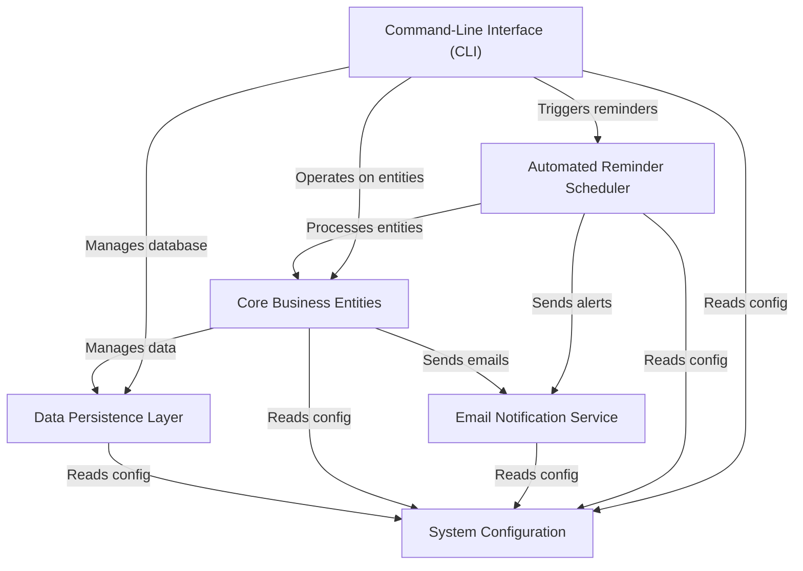

# Khatabook Auto Reminder System

## Overview

The Khatabook Auto Reminder System is like a *digital ledger* that helps track money owed and borrowed. Its main purpose is to **automatically send email reminders** to people when their credit payments are due or overdue, preventing bad debt. You can also use it to *manage users*, *record credit transactions*, and *generate reports* through a simple command-line interface.

## Visual Overview

## Features

- **User Management:** Add, update, delete users with credit limits.
- **Credit Management:** User credit requests with limit checks.
- **Overdue Alerts:** Reminder emails 7 days before, on due date, 7 days after.
- **Bad Debt Prevention:** Flags users with unpaid credits over 60 days.
- **Email Notifications:** Uses SMTP for notification emails.
- **Database:** SQLite for data persistence with backup.
- **Testing:** Unit tests for core functionality.

## Setup Instructions

1. Install Python 3.x.

2. Install dependencies (if any).

3. Configure `config.py` with your email SMTP credentials.

4. Run the program:

